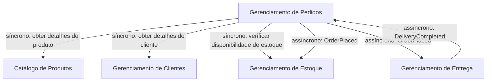

Dependências entre módulos:

- Catalog: Não depende de outros módulos
- Stock: Depende do Catalog
- User: Não depende de outros módulos
- Sale: Depende de Catalog, User e Stock
- Delivery: Depende de Sale e User

---

Exemplo de interação entre modulos na processo da venda.

