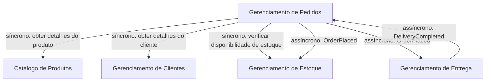

## Branch estrutura básica

Pontos importantes das definições para implementação do modulith.

### Root pom.xml

Iniciando os principais pontos, precisamos compreender a necessidade do pom.xml pai (root POM) em um projeto Maven multi-módulo, pois ele cumpre um papel estratégico e centralizador no gerenciamento de um monólito modular com Quarkus.

Abaixo iremos compreender cada tag desse [arquivo](pom.xml).

**Organização modular**

A seção `<modules>` define explicitamente quais são os submódulos que compõem o projeto. Isso:
* Permite compilar e construir todos os módulos com um único comando (mvn clean install na raiz);
* Garante o controle de ordem de build (por dependência) entre os módulos;
* Favorece a modularidade lógica dentro de um único artefato (o monólito);
* Reflete a separação conceitual dos bounded contexts.

**Gerenciamento centralizado de dependências**

A seção `<dependencyManagement>` define a versão do BOM (Bill Of Materials) do Quarkus. Esse BOM:
* Garante versões compatíveis e testadas entre os vários componentes do ecossistema Quarkus;
* Evita repetição de versões nos módulos filhos (eles herdam automaticamente);
* Reduz o risco de conflito de dependências transitivas;
* Centraliza a governança de dependências no POM raiz (seguindo boas práticas de versionamento e segurança).

**Configuração de plugins e propriedades**

As `<properties>` definem:
* Versão do Java (maven.compiler.release=17);
* Versão dos plugins (ex: maven-compiler-plugin, surefire-plugin);
* Codificação (UTF-8);
* São herdadas por todos os módulos;
* Garantem uniformidade de compilação e execução;
* Reduzem configuração duplicada nos POMs filhos.

**O PONTO MAIS IMPORTANTE - Configuração do jandex-maven-plugin**

A configuração do jandex é um dos pontos mais importantes que temos no root pom, sem ele o Quarkus não conseguiria realizar a descoberta de beans em outros módulos. Podemos observar esse ponto na documentação oficial do Quarkus sobre.


```xml
<build>
  <plugins>
    <plugin>
      <groupId>io.smallrye</groupId>
      <artifactId>jandex-maven-plugin</artifactId>
      <version>3.3.1</version>
      <executions>
        <execution>
          <id>make-index</id>
          <goals>
            <goal>jandex</goal>
          </goals>
        </execution>
      </executions>
    </plugin>
  </plugins>
</build> 
```

Podemos fazer essa mesma indexação dos modulos diretamente no aplication.properties do módulo `app`, como no exemplo abaixo:
```
quarkus.index-dependency.catalog.group-id=com.aktie
quarkus.index-dependency.catalog.artifact-id=catalog
```
O problema dessa segunda abordagem é lembrar a cada novo módulo de adicionar essa config, algo que o jandex já faz automáticamente.

**Papel do root pom construção do monólito modular**
* Isola a complexidade de cada módulo (por domínio ou funcionalidade);
* Torna mais fácil aplicar princípios de arquitetura modular;
* Permite que módulos como catalog, sale, stock evoluam independentemente, ainda que no mesmo artefato de deploy;
* Serve como ponto único de entrada para o build e distribuição do monólito (inclusive se for empacotado como um único JAR fat).

**Outros pontos importantes**

Mesmo o pom.xml root sendo muito importante, não é ele que inicia nossa aplicação, e sim o projeto `app`. Nesse projeto em seu pom.xml temos os `<goals>` do maven para gerar build, teste e executar o projeto.

É um setup que favorece futuramente extrair algum módulo como um microserviço ou plugin externo.

🌟**Links úteis**

[Maven pom reference](https://maven.apache.org/pom.html)

[Quarkus and Maven](https://quarkus.io/guides/maven-tooling#multi-module)

---

### Passo a passo para adicionar um módulo

---

### Como essa mágica funciona?

Tudo isso é possível ao [CDI](https://dev.to/vepo/contexts-and-dependency-injection-cdi-2-0-1ae4), o CDI (Contexts and Dependency Injection) é uma especificação do Java (originalmente do Java EE, agora Jakarta EE) que o Quarkus implementa para gerenciar injeção de dependências.

> **Em termos simples**: CDI é um gerenciador de objetos inteligentes. Ele cria, configura e conecta objetos automaticamente, com base em anotações como @Inject, @ApplicationScoped, @Singleton, etc.

Como CDI permite essa "mágica" entre os módulos?

1. Descoberta automática, durante o build, o CDI (com ajuda do Jandex) escaneia todas as classes anotadas como beans(@ApplicationScoped, @Singleton). Essas classes são registradas em um contexto comum e ficam disponíveis para injeção.
2. Injeção de dependências entre módulos, mesmo que `catalog` e `sale` estejam em módulos separados, se `catalog` tiver um bean, `sale` pode realizar a injeção de dependência dele(@Inject).
3. Desacoplamento e modularidade! Você não precisa saber "quem criou o objeto" nem importar implementações concretas diretamente. Isso permite, módulos independentes, baixo acoplamento e testabilidade.
4. Descoberta em tempo de compilação. Quarkus otimiza o CDI com Jandex(índice de anotações), **Build time wiring** (conexão das dependências é feita em tempo de build, não em runtime como no Spring); Isso gera melhor desempenho e torna possível compilar para binário nativo com GraalVM.

🌟**Links úteis**

[CDI no Quarkus](https://quarkus.io/guides/cdi-reference#jandex)

[Espec CDI Jakarta](https://jakarta.ee/specifications/cdi/)

---

### Estrutura do projeto

Dependências entre módulos(objetivo do projeto ao finalizar*):

- Catalog: Não depende de outros módulos
- Stock: Depende do Catalog
- User: Não depende de outros módulos
- Sale: Depende de Catalog, User e Stock
- Delivery: Depende de Sale e User

---

Exemplo de interação entre modulos na processo da venda.

